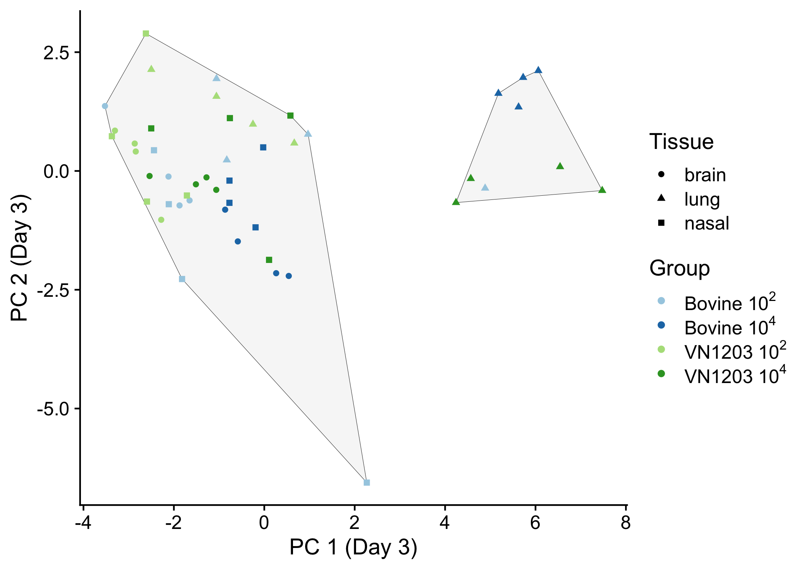
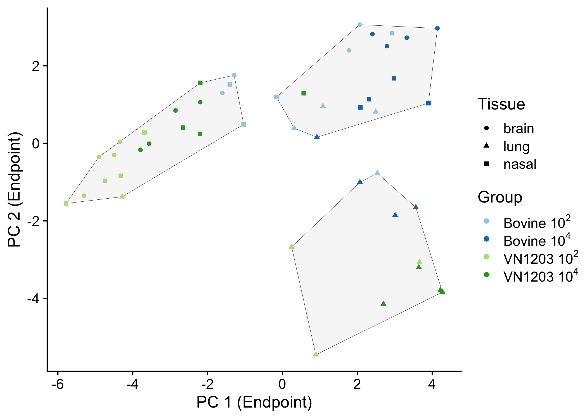

## Enhanced encephalitic tropism of bovine H5N1 compared to the Vietnam H5N1 isolate in mice

This repository contains the data and code for the PCA analysis
discussed in the manuscript, “Enhanced encephalitic tropism of bovine
H5N1 compared to the Vietnam H5N1 isolate in mice”. The data will be
available on [Figshare](https://doi.org/10.6084/m9.figshare.27679509)
after publication.

The Principal Component Analysis (PCA) of viral titer, protein abundance
and mRNA levels in brain, lung and nasal turbinates of mice, separated
by day of harvest (day 3 and endpoint).

Analysis at 3 days post inoculation resulted in two distinct clusters:
the smaller cluster contained only lung samples, all but one of which
were high dose groups. The remaining low-dose lung samples, all brain,
and all nasal samples were contained in the larger cluster.

In the PCA of samples collected at endpoint, the optimal number of
clusters was determined to be three, with clusters similar in size. One
cluster was primarily composed of VN1203-exposed samples, while a second
cluster mainly contained Bov342-exposed samples, both predominantly from
brain and nasal turbinate samples. The third cluster contained only lung
samples, where all but one of the VN1203exposed mice clustered together
with most of the high-dose Bov342-exposed mice. Most of the low-dose
Bov342-exposed lung tissues clustered with the Bov342-exposed brain and
nasal samples.

